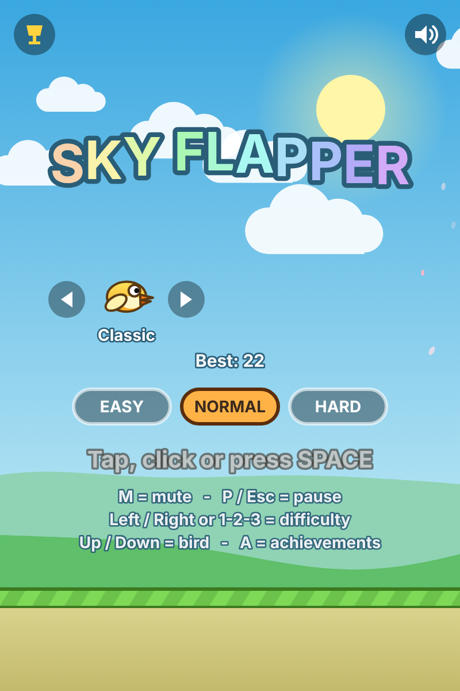
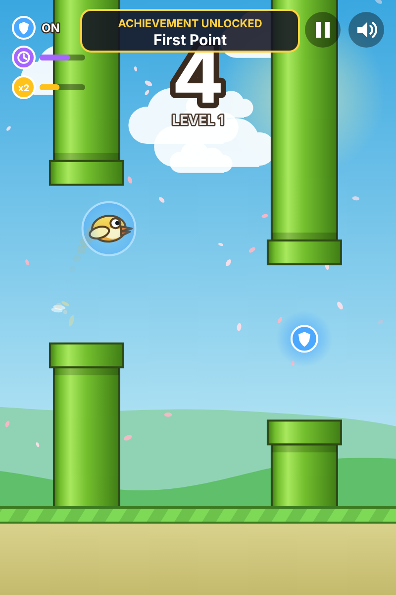
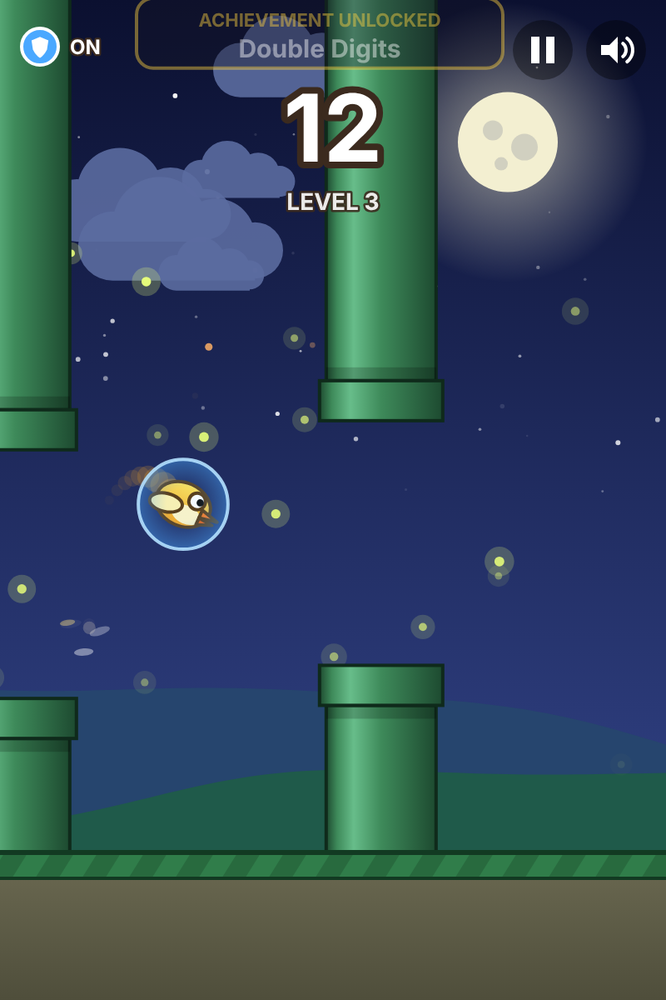
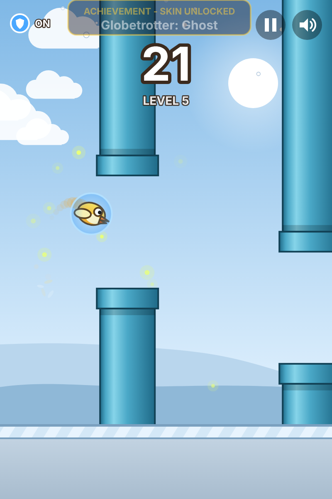
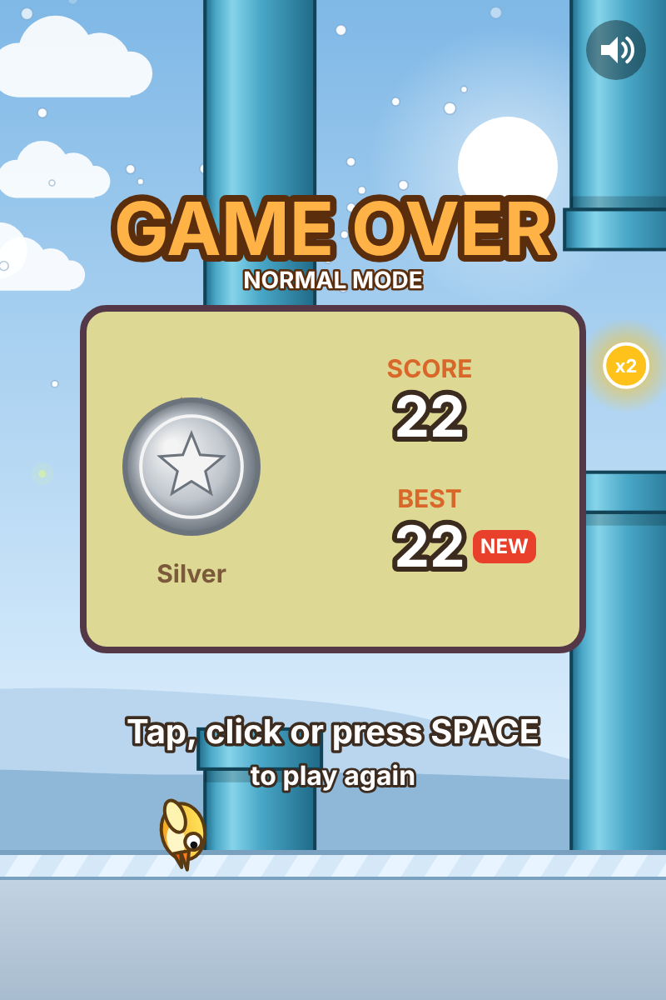
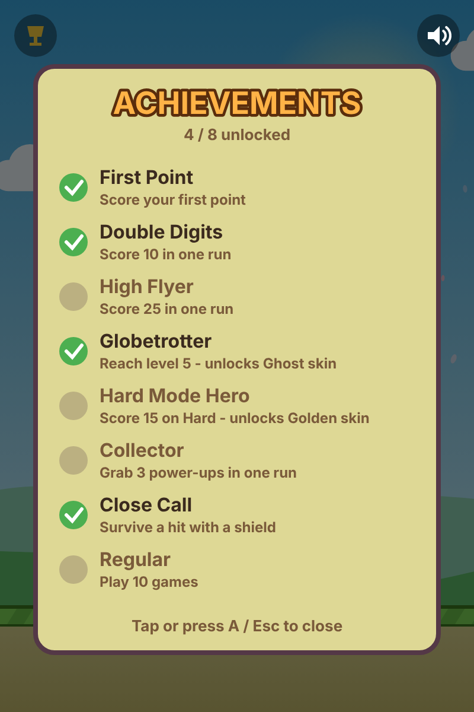

# Sky Flapper


A polished Flappy Bird-style game in plain HTML, CSS and JavaScript. Everything is drawn on a canvas and all sounds are generated with the Web Audio API, so there are no libraries, images or audio files.

**Play it:** `https://YOUR_USERNAME.github.io/sky-flapper/` (replace with your own GitHub Pages URL once deployed)

| | | |
| :---: | :---: | :---: |
| <br>Start screen | <br>Power-ups | <br>Night level |
| <br>Frost level | <br>Game over | <br>Achievements |

## How to run

Open `index.html` in a modern browser. There is no build step. To serve it locally instead:

```sh
python3 -m http.server 8000
```

## Controls

| Action | Input |
| --- | --- |
| Flap / start / restart | Space, mouse click or touch |
| Pause / resume | P, Esc or the on-screen pause button |
| Mute | M or the on-screen speaker button |
| Change difficulty (start screen) | Left / Right, keys 1-2-3, or tap a button |
| Change bird (start screen) | Up / Down or the arrows beside the bird |
| Achievements (start screen) | A or the trophy button |

## Features

**Gameplay**
- Delta-time physics, capped so tab switches don't cause jumps. Same speed on 60 Hz and 144 Hz screens.
- Difficulty presets (Easy, Normal, Hard). Speed rises and the gap narrows as you score, down to a safe minimum. Best scores are kept per difficulty.
- Levels: the theme changes every 5 points (Meadow, Sunset, Night, Desert, Frost) with a smooth color blend and a level banner.
- Power-ups float in some pipe gaps: **shield** (survive one hit), **slow-mo** (slower pipes) and **double points**.
- Medals at 10, 20, 30 and 40 points (Bronze, Silver, Gold, Platinum).
- Pause with a 3-2-1 countdown on resume. The game auto-pauses when the tab loses focus.

**Collectibles and progress**
- Bird skins. Two are locked until you earn the matching achievement.
- Eight achievements with unlock toasts, saved between visits.

**Look and feel**
- Everything drawn on canvas: parallax clouds and hills, 3D-shaded pipes, a sun that turns into a moon, and a bird trail.
- Themed particles: petals, embers, fireflies, desert dust and snow.
- Bird tilt, wing animation, flap feathers, screen shake and flash on collision, score pop and an animated title.
- Sharp on high-DPI screens, and scales to fit any window while keeping its aspect ratio.
- Sound effects from the Web Audio API with a remembered mute setting.
- Best score, difficulty, skin and achievements saved in `localStorage`, with a session-only fallback if storage is blocked.

## Project structure

```
index.html            page shell
css/style.css         page styling
js/config.js          every tunable value (CONFIG)
js/state.js           shared state, theme blending, persistence
js/audio.js           Web Audio sound effects
js/features.js        skins, power-ups, achievements
js/input.js           keyboard, mouse and touch
js/update.js          per-frame game logic
js/collision.js       collision checks
js/render.js          world drawing
js/ui.js              HUD, menus, overlays
js/main.js            resize, event wiring, main loop
docs/screenshots/     images used in this README
.github/workflows/    GitHub Pages deployment
```

## Customizing

All tunable values live in the `CONFIG` object in `js/config.js`:

- `bird`, `pipes`: gravity, flap strength, hitbox, pipe width and spacing.
- `difficulty.presets`: speed, speed cap, gap size and minimum gap for each difficulty.
- `levels`: points per level and the theme list (colors, sun or moon, particle type).
- `skins`, `powerups`, `achievements`: skin colors, power-up chance and durations, achievement targets.
- `medals`, `sound`, `pause`, `storage`, `feedback`, `visuals`: thresholds, volume, countdown length, storage keys, effect strengths.

Most features have an `enabled` flag so you can switch them off.

## Deploy to GitHub Pages

The workflow in `.github/workflows/pages.yml` publishes the game on every push to `main`.

1. Push the repository to GitHub.
2. Go to **Settings > Pages** and set **Source** to **GitHub Actions**.
3. Push to `main` (or run the workflow manually). The live URL appears in the workflow run.

## License

[MIT](LICENSE)
